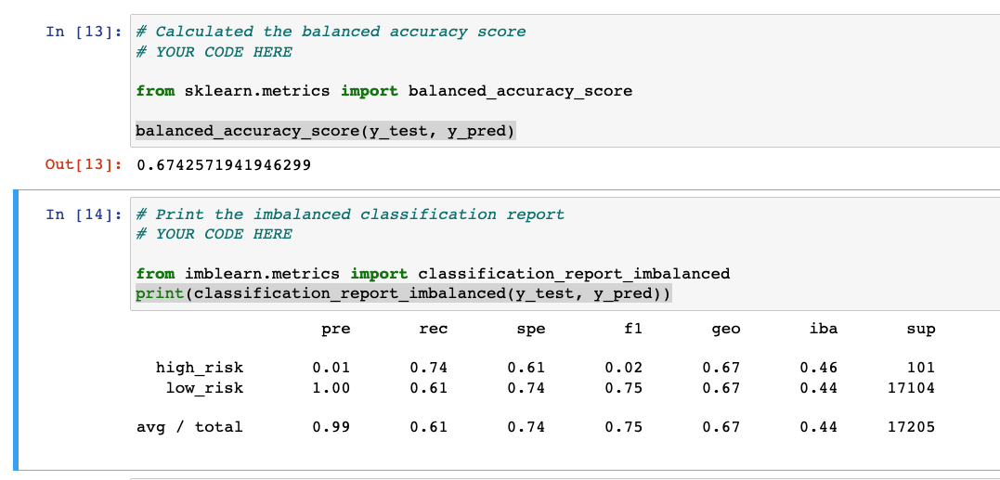
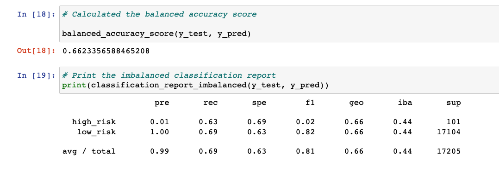
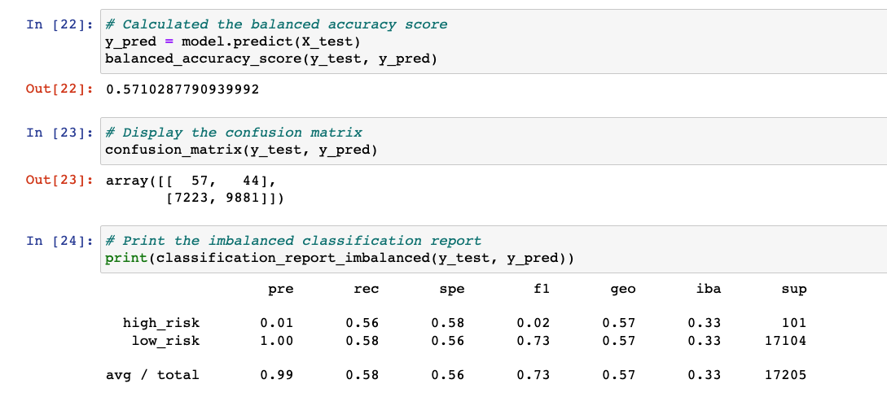
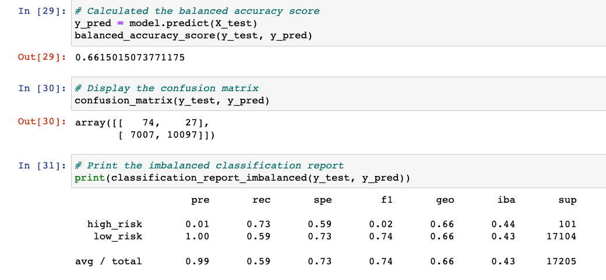
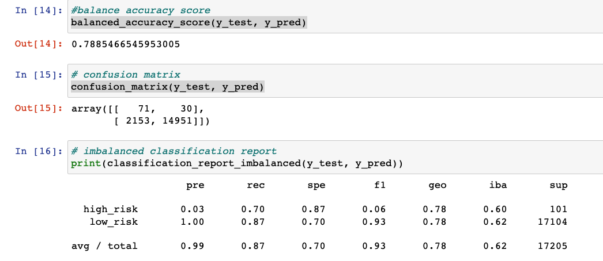
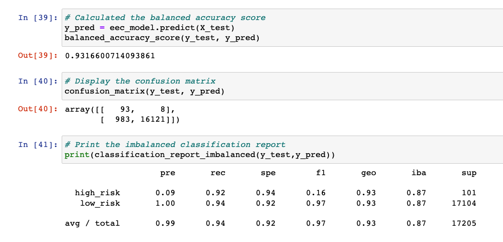
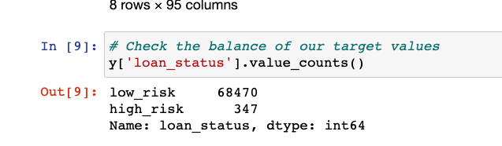

# Credit_Risk_Analysis

## Overview
The purpose of this project is to create and compare different models to predict credit risk.
Then evaluate the performance of each model on how well they can predict credit risk and
finally, recommend which model should be chosen.

## Results

The results of each model is as follows.

### Naive Random Oversampling
- Balanced Accuracy score of *67%*
- Precision score of *1%* and Recall score of *74%* for High-Risk predictions
- Precision score of *100%* and Recall score of *61%* for Low-Risk predictions

### SMOTE Oversampling
- Balanced Accuracy score of *66%*
- Precision score of *1%* and Recall score of *63%* for High-Risk predictions
- Precision score of *100%* and Recall score of *69%* for Low-Risk predictions

### Random Undersampling
- Balanced Accuracy score of *57%*
- Precision score of *1%* and Recall score of *56%* for High-Risk predictions
- Precision score of *100%* and Recall score of *58%* for Low-Risk predictions

### Combo Sampling
- Balanced Accuracy score of *66%*
- Precision score of *1%* and Recall score of *73%* for High-Risk predictions
- Precision score of *100%* and Recall score of *59%* for Low-Risk predictions

### Balanced Random Forest 
- Balanced Accuracy score of *79%*
- Precision score of *3%* and Recall score of *70%* for High-Risk predictions
- Precision score of *100%* and Recall score of *87%* for Low-Risk predictions

### Easy Ensemble Classifier
- Balanced Accuracy score of *93%*
- Precision score of *9%* and Recall score of *92%* for High-Risk predictions
- Precision score of *100%* and Recall score of *94%* for Low-Risk predictions

## Summary
In summary, it is clear that the best model to use in predicting credit risk is the
**Easy Ensemble Classifier** model. With a *93%* score for Balanced Accuracy, the model
outperforms all the other models in predicting True Positives and True Negatives accurately.
All the models including Easy Ensemble, came in with very poor Precision scores for High-Risk
predictions. *1%* for the resampling models and *3%* for Balanced Random Forest and *9%*
for Easy Ensemble. Also, all models scored *100%* Precision for predicting Low-Risk.
Given these scores, we typically would be suspicious of the values. But, I think in this
case, the data for Low-Risk severely outweighs High-Risk. We can see this in the value counts.

So, for our purposes, we should rely on Recall scores to make a determination on which model
should be selected for our Credit Risk Analysis. For, this analysis, **Easy Ensemble** is also
the best model to use with Recall scores of *92%* for High-Risk predictions and *94%* for
Low-Risk predictions.

